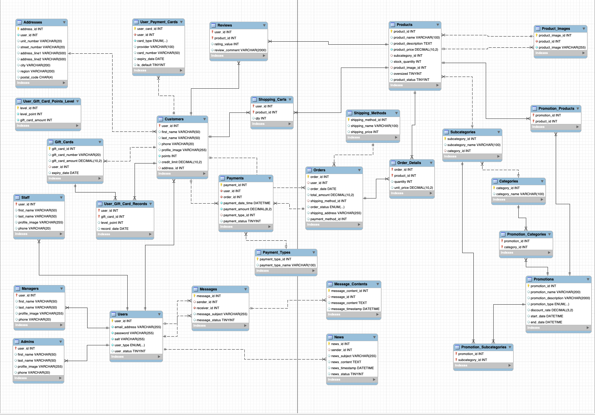
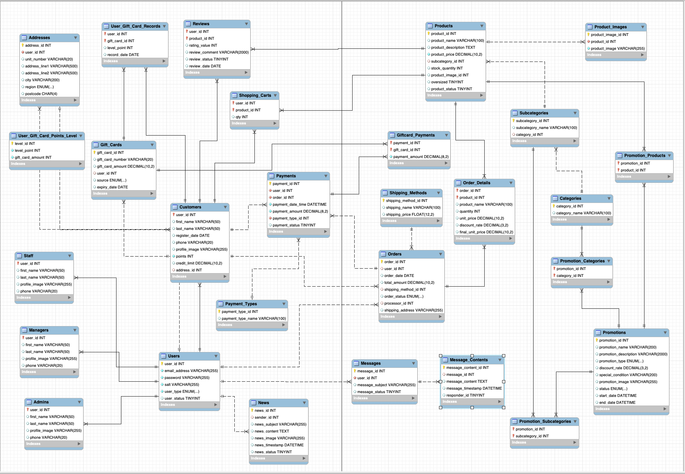

# COMP639S1_Group_AR_PROJECT_2

https://arproject2.pythonanywhere.com/

## Instructions

### 1. Project Structure

#### 1.1. util

Define utility functions to use

#### 1.2. template

Stores all html files

#### 1.3. db

It contains all db connection configs and setups, includes query strings

#### 1.4. Database design
##### Initial Database design

##### Final Database design


### 2. Development

Since it's a group work, we need to ensure each member's changes do not break others' work.

So we will use a feature branching strategy.

The main branch is used to deployment. 

DO NOT make any direct changes on main.

Each member work on his/her own branch. Once your changes are done and tested locally, commit your change, push to Github, then create a Pull Request, and ask your team member to approve. Then you can merge your branch to the main.

If there is any error on main after your merge, please fix it.

Below are the detailed steps:

#### 2.1. Dowload the project from Github
```
git clone [project url]
```

#### 2.2. Install dependencies

Run commands to install dependencies in the requirements.txt file:
```
pip3 install -r requirements.txt
```

#### 2.3. Create your own branch

Step A: Make sure that you are on the main branch:

```
git branch
```

You will see this, which means you are on the main branch:

```
* main
  feature/19
```

If you are not on the main branch, check out to main:
```
git checkout main
```

Step B: create your branch with the ticket number. For example you are wokring on ticket 19, then run the command to create your own branch:
```
git checkout -B feature/19
```

Then you create a branch named feature/19.

#### 2.4. Commit your changes

If you are satified with your changes, commit your changes to your branch:
```
git status
git add .
git commit -m "[leave your commit message]"
```

Try to include the ticket number and what changes you made in the commit message so that other team member can easily understand what you have done. 

For example, you are working on ticket 19 which is adding login function, a good commit example could be:
```
git commit -m "19: adding login function"
```

Then push your changes to Github:
```
git push
```

#### 2.5. Create a Pull Request

Go to the Github page, click "Pull Request", set main as "base" and your branch as "compare".

Then add team members as reviewers. Let other team members to approve it, then you can merge it.

If your changes involce database changes, please don't forget to go to pythonanywere to run the database scripts.

#### 2.7. Deploy to PythonAnywhere

Pyhtonanywhere is already been setup to link to our Github repo, you just need to go to the Console:
```
Bash console 33599583 
```
to run a "git pull" command. DO NOT DELETE THIS CONSOLE!! The whole project is stored here.

Once you log into the console, run the command:
```
cd /home/arproject2/COMP639S1_Group_AR_PROJECT_2
git pull
``` 

Then go to the "Web", reload the web. Then check the web app link: https://agtech.pythonanywhere.com/ and verify your changes.

#### 2.6. Continue development

Assuming you have the project in your local and you have pushed one branch to the main. Now you will need to work on a new ticket.

!!! Important !!!

Before create a new branch, please checkout to main, and do a git pull to get the latest changes on main. It can ensure your local main is sync to the github remote main so that you won't get any conflict in the future.
```
git checkout main
git pull
```


### 3. Deployment

The project is hosted at pyhtonanywhere.

https://www.pythonanywhere.com/user/arproject2/

username: arproject2

password: UcoTzEMq5W

Web app link: https://arproject2.pythonanywhere.com/

Project console: Bash console 33599583

Database console: MySQL: arproject2$default


### 4. Log-in Details

Customer:
john.doe@example.com
lisa.johnson@example.com
sarah.nguyen@example.com

Staff:
simon123@example.com
simon456@example.com

Manager:
mark123@example.com

Admin:
tim123@example.com


Password(for all account)
12345678
